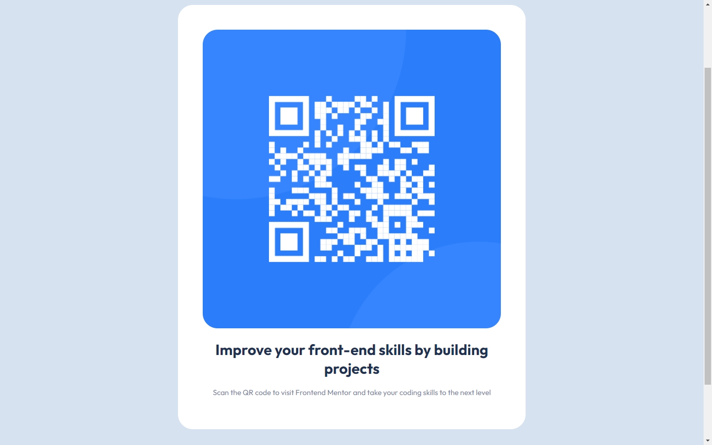

# Frontend Mentor - QR code component solution

This is a solution to the [QR code component challenge on Frontend Mentor](https://www.frontendmentor.io/challenges/qr-code-component-iux_sIO_H). Frontend Mentor challenges help you improve your coding skills by building realistic projects. 

## Table of contents

- [Overview](#overview)
  - [Screenshot](#screenshot)
  - [Links](#links)
- [My process](#my-process)
  - [Built with](#built-with)
  - [What I learned](#what-i-learned)
  - [Continued development](#continued-development)
- [Author](#author)
- [Acknowledgments](#acknowledgments)

## Overview
Although I found it difficult the first time I tried this exercise and almost completely gave up on it, I managed to pull through and complete the exercise. Even if I did not achieve the goal as the exercise said to, I'm still proud of what I did and I expect to get better in the future and visit this exercise again to see how much better I've gotten since now.

### Screenshot



### Links

- Live Site URL: (https://frontendmentor-qrmerme.netlify.app/)

## My process
I first started working with the original 'index.html' file which came with the folder along with the images and the design. Then I put the QR, the title as a <h1> and the info as a <p>. Later I labeled the <div> group which contained these three as 'class="qr"' so that I could give each element a group based on BEM, being:
'qr__img' for the QR code,
'qr__title' for the main title,
and 'qr__info' for the text.

Then, I made a new CSS file called 'stylesheet.css' so that I could get started on this project. However, I got frustrated because although I had a 'display: flex' property along with 'justify-content: center' and 'align-items: center', the <div> couldn't get centered in the Y axis. For this reason, I almost gave up on this project and deleted all my progress, but I decided to watch a tutorial for a solution and I understood that I needed a 'max-height' property in <body> so that it could get centered. I made everything from scratch again and I finally ended up with this result.

### Built with

- VSCode (For writing code)

### What I learned
I learned that I need to stay calm when I commit a mistake. Coding isn't perfect, and I will encounter various brick walls throughout this journey, however, I'll find the way to overcome them.

I also learned that if I want to center a <div> element in the Y axis, I must have a height established. As I'm writing this, I find it weird that I didn't realise why it wasn't working when I had a 'width' property as well.

```css
.new_learning {
  max-height: 1200px;
}
```

### Continued development
I would like to learn more about CSS. CSS for me has ups and downs that I would like to master in order to understand more about this language.

## Author

- Frontend Mentor - [@Merme-Github](https://www.frontendmentor.io/profile/Merme-GitHub)
- Twitter - [@MermeCoding](https://twitter.com/MermeCoding)

**Note: Delete this note and add/remove/edit lines above based on what links you'd like to share.**

## Acknowledgments

I would like to thank the user [@ionandrei44] in his video 'QR Code Component | Frontend Mentor' (HTML & CSS) (https://www.youtube.com/watch?v=dXpYll1_42k) for giving me the whole idea of using the 'max_height' option in my coding, I found that really helpful.